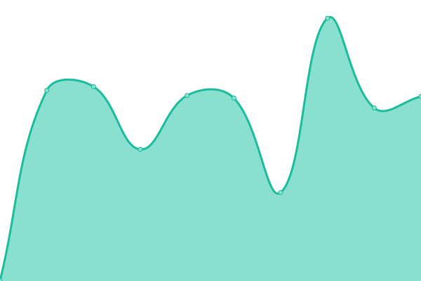
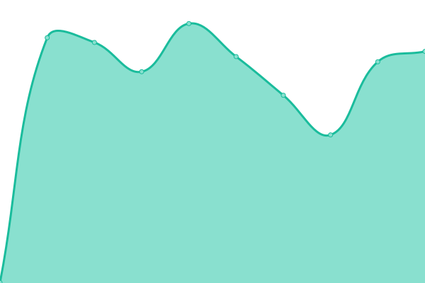

# [📈 Live Status](https://status.gwto.cc): <!--live status--> **🟧 Partial outage**

This repository contains the open-source uptime monitor and status page for [광토리](https://gwangtori.com), powered by [Upptime](https://github.com/upptime/upptime).

With [Upptime](https://upptime.js.org), you can get your own unlimited and free uptime monitor and status page, powered entirely by a GitHub repository. We use [Issues](https://github.com/Gwangtori/upptime/issues) as incident reports, [Actions](https://github.com/Gwangtori/upptime/actions) as uptime monitors, and [Pages](https://status.gwto.cc) for the status page.

<!--start: status pages-->
<!-- This summary is generated by Upptime (https://github.com/upptime/upptime) -->
<!-- Do not edit this manually, your changes will be overwritten -->
<!-- prettier-ignore -->
| URL | Status | History | Response Time | Uptime |
| --- | ------ | ------- | ------------- | ------ |
|  [Introduce Page](https://me.gwangtori.com) | 🟩 Up | [introduce-page.yml](https://github.com/Gwangtori/upptime/commits/HEAD/history/introduce-page.yml) | 

 367ms
     
 | 

<a href="https://status.gwto.cc/history/introduce-page">100.00%</a>
    

|  [onemindwiki](https://onemind.gwto.cc) | 🟩 Up | [onemindwiki.yml](https://github.com/Gwangtori/upptime/commits/HEAD/history/onemindwiki.yml) | 

 1218ms
     
 | 

<a href="https://status.gwto.cc/history/onemindwiki">73.92%</a>
    

|  [IT blog](https://it.gwangtori.com) | 🟩 Up | [it-blog.yml](https://github.com/Gwangtori/upptime/commits/HEAD/history/it-blog.yml) | 

 1817ms
     
 | 

<a href="https://status.gwto.cc/history/it-blog">100.00%</a>
    

|  [daol wiki](https://wiki.daol.cc) | 🟥 Down | [daol-wiki.yml](https://github.com/Gwangtori/upptime/commits/HEAD/history/daol-wiki.yml) | 

 589ms
     
 | 

<a href="https://status.gwto.cc/history/daol-wiki">73.07%</a>
    

|  [daol social](https://social.daol.cc) | 🟩 Up | [daol-social.yml](https://github.com/Gwangtori/upptime/commits/HEAD/history/daol-social.yml) | 

 433ms
     
 | 

<a href="https://status.gwto.cc/history/daol-social">100.00%</a>
    

<!--end: status pages-->

[**Visit our status website →**](https://status.gwto.cc)

## 📄 License

- Powered by: [Upptime](https://github.com/upptime/upptime)
- Code: [MIT](./LICENSE) © [광토리](https://gwangtori.com)
- Data in the `./history` directory: [Open Database License](https://opendatacommons.org/licenses/odbl/1-0/)
